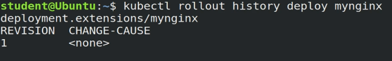

# K8s-Deployment-and-DaemonSets.
## Deployments (1)
Deployment objects provide declarative updates to Pods and ReplicaSets. The DeploymentController is part of the control plane node's controller manager, and as a controller it also ensures that the current state always matches the desired state of our running containerized application. It allows for seamless application updates and rollbacks, known as the default RollingUpdate strategy, through rollouts and rollbacks, and it directly manages its ReplicaSets for application scaling. It also supports a disruptive, less popular update strategy, known as Recreate.

Below is an example of a Deployment object's definition manifest in YAML format. This represents the declarative method to define an object, and can serve as a template for a much more complex Deployment definition manifest if desired:

```yaml
apiVersion: apps/v1
kind: Deployment
metadata:
  name: nginx-deployment
  labels:
    app: nginx-deployment
spec:
  replicas: 3
  selector:
    matchLabels:
      app: nginx-deployment
  template:
    metadata:
      labels:
        app: nginx-deployment
    spec:
      containers:
      - name: nginx
        image: nginx:1.20.2
        ports:
        - containerPort: 80
```

The apiVersion field is the first required field, and it specifies the API endpoint on the API server which we want to connect to; it must match an existing version for the object type defined. The second required field is kind, specifying the object type - in our case it is Deployment, but it can be Pod, ReplicaSet, Namespace, Service, etc. The third required field metadata, holds the object's basic information, such as name, annotations, labels, namespaces, etc. Our example shows two spec fields (spec and spec.template.spec). The fourth required field spec marks the beginning of the block defining the desired state of the Deployment object. In our example, we are requesting that 3 replicas, that is 3 instances of the Pod, are running at any given time. The Pods are created using the Pod Template defined in spec.template. A nested object, such as the Pod being part of a Deployment, retains its metadata and spec and loses its own apiVersion and kind - both being replaced by template. In spec.template.spec, we define the desired state of the Pod. Our Pod creates a single container running the nginx:1.20.2 image from Docker Hub.

The above definition manifest, if stored by a def-deploy.yaml file, is loaded into the cluster to run a set of three identical Pod replicas and their associated container image, together with their managing ReplicaSet. While create is exemplified below, advanced Kubernetes practitioners may opt to use apply instead:

```bash
$ kubectl create -f def-deploy.yaml
```

Imperatively, we can simply run the Deployment defined above without the definition manifest as such. The following is a multi-line command that should be selected in its entirety for copy/paste (including the backslash character “\”):

```bash
$ kubectl create deployment nginx-deployment \
--image=nginx:1.20.2 --port=80 --replicas=3
```

However, when in need of a starter definition manifest, knowing how to generate one can be a life-saver. The imperative command with additional key flags such as dry-run and the yaml output, can generate the definition template instead of running the Deployment, while the template is then stored in the nginx-deploy.yaml file. The following is a multi-line command that should be selected in its entirety for copy/paste (including the backslash character “\”):

```yaml
$ kubectl create deployment nginx-deployment \
--image=nginx:1.20.2 --port=80 --replicas=3 \
--dry-run=client -o yaml > nginx-deploy.yaml
```

We can generates a Deployment definition manifest in JSON:

```bash
$ kubectl create deployment nginx-deployment \
--image=nginx:1.20.2 --port=80 --replicas=3 \
--dry-run=client -o json > nginx-deploy.json
```

Both the YAML and JSON definition files can serve as templates or can be loaded into the cluster respectively as such:

```bash
$ kubectl create -f nginx-deploy.yaml
$ kubectl create -f nginx-deploy.json
```

Once the Deployment object is created, the Kubernetes system attaches the status field to the object and populates it with all necessary status fields.

In the following example, a new Deployment creates ReplicaSet A which then creates 3 Pods, with each Pod Template configured to run one nginx:1.20.2 container image. In this case, the ReplicaSet A is associated with nginx:1.20.2 representing a state of the Deployment. This particular state is recorded as Revision 1.


In time, we need to push updates to the application managed by the Deployment object. Let's change the Pods' Template and update the container image from nginx:1.20.2 to nginx:1.21.5. The Deployment triggers a new ReplicaSet B for the new container image versioned 1.21.5 and this association represents a new recorded state of the Deployment, Revision 2. The seamless transition between the two ReplicaSets, from ReplicaSet A with three Pods versioned 1.20.2 to the new ReplicaSet B with three new Pods versioned 1.21.5, or from Revision 1 to Revision 2, is a Deployment rolling update.

## Deployments (2)

A rolling update is triggered when we update specific properties of the Pod Template for a deployment. While planned changes such as updating the container image, container port, volumes, and mounts would trigger a new Revision, other operations that are dynamic in nature, like scaling or labeling the deployment, do not trigger a rolling update, thus do not change the Revision number.

Once the rolling update has completed, the Deployment will show both ReplicaSets A and B, where A is scaled to 0 (zero) Pods, and B is scaled to 3 Pods. This is how the Deployment records its prior state configuration settings, as Revisions.


Once ReplicaSet B and its 3 Pods versioned 1.21.5 are ready, the Deployment starts actively managing them. However, the Deployment keeps its prior configuration states saved as Revisions which play a key factor in the rollback capability of the Deployment - returning to a prior known configuration state. In our example, if the performance of the new nginx:1.21.5 is not satisfactory, the Deployment can be rolled back to a prior Revision, in this case from Revision 2 back to Revision 1 running nginx:1.20.2 once again.


Before advancing to more complex topics, become familiar with Deployment operations with additional commands such as:

```bash
$ kubectl apply -f nginx-deploy.yaml --record
$ kubectl get deployments
$ kubectl get deploy -o wide
$ kubectl scale deploy nginx-deployment --replicas=4
$ kubectl get deploy nginx-deployment -o yaml
$ kubectl get deploy nginx-deployment -o json
$ kubectl describe deploy nginx-deployment
$ kubectl rollout status deploy nginx-deployment
$ kubectl rollout history deploy nginx-deployment
$ kubectl rollout history deploy nginx-deployment --revision=1
$ kubectl set image deploy nginx-deployment nginx=nginx:1.21.5 --record
$ kubectl rollout history deploy nginx-deployment --revision=2
$ kubectl rollout undo deploy nginx-deployment --to-revision=1
$ kubectl get all -l app=nginx -o wide
$ kubectl delete deploy nginx-deployment
$ kubectl get deploy,rs,po -l app=nginx
```

## Do in your own way:

Create a deployment by using command.

```bash
kubectl create deployment mynginx --image=nginx:1.15-alpine
```

Now see the deployments, pod, rs and so on

```bash
kubectl get deploy,rs,po -l app=mynginx
```

It will show like this below:


We can see deployment is created rs is ready as well. Now scale the deployment up to 3 replicas. /code

```bash
kubectl scale deploy mynginx --replicas=3
```

Now the command befor again to see replicas and deployments.


Just remember the replica set name "cfcc,” because we will now see how the replica set extended.

```bash
kubectl describe deploy mynginx
```


Now see the rollout history:

```bash
kubectl rollout history deploy mynginx
```



So far we have a single revision, and that’s for the current state of deployment. And revision one is associated with the nginx 1.15 image. And it is associated with the ReplicaSet ending with cfcc. Now, I can also further display details about the revision, by providing revision number.

```bash
kubectl rollout history deploy mynginx --revision=1
```

So in this case, is revision one. And we see in the revision information display, again, the image is displayed as nginx 1.15-alpine.

Now, let's keep an eye on the images as they change throughout the rolling update and the rollback processes.

Now, let's perform a rolling update. Now remember, a rolling update does not necessarily mean an upgrade. I could perform a rolling update and actually move down in the image version. But in this case, we will be moving up, so, the rolling update will also perform an upgrade on our image. So let's upgrade our image.

```bash
kubectl set image deployment mynginx nginx=nginx:1.16-alpine
```

Now, the image has been updated. So, I could look at the rollout history of the deployment.

```bash
kubectl rollout history deploy mynginx
```


And now we have two revisions. One was for the original state, and two is for the most recent state.

Let's look at the details of each. Let's look at revision one first.

```bash
kubectl rollout history deploy mynginx --revision=1
```


And we see that it was for the 1.15-alpine image. And if we display details of revision two.


It shows the 1.16-alpine image, the updated image.

Now, let's take a quick look at our objects. So let's display Deployment, ReplicaSets, and Pods for the mynginx app.

```bash
kubectl get deploy,rs,po -l app=mynginx
```


So we have the same deployment. Three replicas ready. We have the three pods running. However, if we're looking at the replica sets, we will see that the original replica set that we had set up originally with three replicas, the cfcc, now been scaled down to zero. So this replica set is recorded as the original state of my deployment. And with the original state, I could basically rollback to this state any time I want. And the new ReplicaSet, ending in 8444, with three running pods, three replicas, is associated with the new and current 1.16-alpine image. And that same replica set is associated with revision number two.

Now, if I'm not happy with the revision number two, I can always just rollback to revision one.

```bash
kubectl rollout undo deployment mynginx --to-revision=1
```

Now see roll-out history:

```bash
kubectl rollout history deploy mynginx
```


And now we see that we have revisions two and three.

```bash
kubectl rollout history deploy mynginx --revision=3
```


And let's also look at Deployments, ReplicaSets, and Pods.

```bash
kubectl get deploy,rs,po -l app=mynginx
```


So now we see that the original replica set ends with cfcc.

Now keep in mind that, by default, you can perform up to 10 consecutive rolling updates. And you can then rollback to any one of those 10 recorded states. In this case, we just performed one rolling update and one rollback. Now, finally, rolling updates and rollbacks are not specific for deployments only. They are supported by other controllers, as well, such as DaemonSets and StatefulSets.

So now we see that the original replica set ends with cfcc.

Now keep in mind that, by default, you can perform up to 10 consecutive rolling updates. And you can then rollback to any one of those 10 recorded states. In this case, we just performed one rolling update and one rollback. Now, finally, rolling updates and rollbacks are not specific for deployments only. They are supported by other controllers, as well, such as DaemonSets and StatefulSets.

## DaemonSets

DaemonSets are operators designed to manage node agents. They resemble ReplicaSet and Deployment operators when managing multiple Pod replicas and application updates, but the DaemonSets present a distinct feature that enforces a single Pod replica to be placed per Node, on all the Nodes or on a select subset of Nodes. In contrast, the ReplicaSet and Deployment operators by default have no control over the scheduling and placement of multiple Pod replicas on the same Node.

DaemonSet operators are commonly used in cases when we need to collect monitoring data from all Nodes, or to run storage, networking, or proxy daemons on all Nodes, to ensure that we have a specific type of Pod running on all Nodes at all times. They are critical API resources in multi-node Kubernetes clusters. The kube-proxy agent running as a Pod on every single node in the cluster, or the Calico or Cilium networking node agent implementing the Pod networking across all nodes of the cluster, are examples of applications managed by DaemonSet operators.

Whenever a Node is added to the cluster, a Pod from a given DaemonSet is automatically placed on it. Although it ensures an automated process, the DaemonSet's Pods are placed on all cluster's Nodes by the controller itself, and not with the help of the default Scheduler. When any one Node crashes or it is removed from the cluster, the respective DaemonSet operated Pods are garbage collected. If a DaemonSet is deleted, all Pod replicas it created are deleted as well.

The placement of DaemonSet Pods is still governed by scheduling properties which may limit its Pods to be placed only on a subset of the cluster's Nodes. This can be achieved with the help of Pod scheduling properties such as nodeSelectors, node affinity rules, taints and tolerations. This ensures that Pods of a DaemonSet are placed only on specific Nodes, such as workers if desired. However, the default Scheduler can take over the scheduling process if a corresponding feature is enabled, accepting again node affinity rules.

Below is an example of a DaemonSet object's definition manifest in YAML format:

```yaml
apiVersion: apps/v1
kind: DaemonSet
metadata:
  name: fluentd-agent
  namespace: default
  labels:
    k8s-app: fluentd-agent
spec:
  selector:
    matchLabels:
      k8s-app: fluentd-agent
  template:
    metadata:
      labels:
        k8s-app: fluentd-agent
    spec:
      containers:
      - name: fluentd
        image: quay.io/fluentd_elasticsearch/fluentd:v4.5.2
```

The above definition manifest, if stored by a fluentd-ds.yaml file, is loaded into the cluster to run a set of identical Pod replicas, with their associated container image, matching in count the number of cluster nodes. While create is exemplified below, advanced Kubernetes practitioners may opt to use apply instead:

```bash
$ kubectl create -f fluentd-ds.yaml
```

Before advancing to more complex topics, become familiar with DaemonSet operations with additional commands such as:

```bash
$ kubectl apply -f fluentd-ds.yaml --record
$ kubectl get daemonsets
$ kubectl get ds -o wide
$ kubectl get ds fluentd-agent -o yaml
$ kubectl get ds fluentd-agent -o json
$ kubectl describe ds fluentd-agent
$ kubectl rollout status ds fluentd-agent
$ kubectl rollout history ds fluentd-agent
$ kubectl rollout history ds fluentd-agent --revision=1
$ kubectl set image ds fluentd-agent fluentd=quay.io/fluentd_elasticsearch/fluentd:v4.6.2 --record
$ kubectl rollout history ds fluentd-agent --revision=2
$ kubectl rollout undo ds fluentd-agent --to-revision=1
$ kubectl get all -l k8s-app=fluentd-agent -o wide
$ kubectl delete ds fluentd-agent
$ kubectl get ds,po -l k8s-app=fluentd-agent
```

## Do your own work: Managing Node Applications with DaemonSets

Now for applications, for monitoring, logging, networking, proxies and so on, where every single node needs to be hosting an instance of that application, the DaemonSet operator is the best suitable controller.


The official Kubernetes documentation presents us with a DaemonSet manifest, but it's quite complex so we've managed to create a simplified version of this operator. So let's go to our terminal and analyze the file, 'cat fluentd-agent.yaml'. So this is our simplified definition manifest. So this aemonSet operator will ensure that every single node in the cluster will be running a replica of the pod defined by this template. And this template actually will be running a fluentd container on every single node. If we pay close attention to this definition file, you see that there are no replicas specified.

So in the case of the deployment operator or the replica set operator, where we need to specify a particular number of replicas, the DaemonSet does not need such a property. The DaemonSet will ensure that every node will receive its own pod replica.

```bash
kubectl apply -f fluentd-agent.yaml
kubectl get daemonsets.apps
```


It seems that we have the DaemonSet operator running and it seems to be managing three pods, three replicas.


The wide output, will be able to show us that every single node in the cluster, the minikube, the control plane node, minicube-m02 and m03, the worker nodes, they each received one instance of the fluentd-agent pod. So every single node in our cluster has received a fluentd logging pod. So typically, this is what you will see a DaemonSet do in the cluster.

Now in our cluster, we have other DaemonSets running as well.


```bash
kubectl get ds -A
```


We'll see that in addition to the fluentd-agent which we have just deployed, there's the calico-node agent and the kube-proxy agent both of them running in the kube-system namespace. The kube-proxy is a part of the control plane of Kubernetes and then the calico-node agent is just one of the components of the calico CNI, the container network interface plugin. So there are several different agents and then in the near future, we will see that there's other components that we may deploy to Kubernetes, which will be managed by DaemonSet operators.

So now it is time to clean up. So let's run 'kubectl delete daemonsets'. So this will target only the DaemonSet, the DaemonSet from our default namespace and we also need to provide a name.

```bash
kubectl delete daemonsets.apps fluentd-agent
```


Let's list all the DaemonSets and it seems that default, the default namespace no longer has a DaemonSet.

```bash
$ kubectl get pods
No resources found in default namespace
```

Let's also run 'kubectl get pods'. Again, from the default namespace and it seems that all pods from the default namespace have been deleted as well, together with the DaemonSet operator.

## Services

A containerized application deployed to a Kubernetes cluster may need to reach other such applications, or it may need to be accessible to other applications and possibly clients. This is problematic because the container does not expose its ports to the cluster's network, and it is not discoverable either. The solution would be a simple port mapping, as offered by a typical container host. However, due to the complexity of the Kubernetes framework, such a simple port mapping is not that "simple". The solution is much more sophisticated, with the involvement of the kube-proxy node agent, IP tables, routing rules, cluster DNS server, all collectively implementing a micro-load balancing mechanism that exposes a container's port to the cluster's network, even to the outside world if desired. This mechanism is called a Service, and it is the recommended method to expose any containerized application to the Kubernetes network. The benefits of the Kubernetes Service becomes more obvious when exposing a multi-replica application, when multiple containers running the same image need to expose the same port. This is where the simple port mapping of a container host would no longer work, but the Service would have no issue implementing such a complex requirement.

This is only a brief introduction of the Kubernetes Service resource. Services, their types, configuration options, and more will be discussed in a later.
